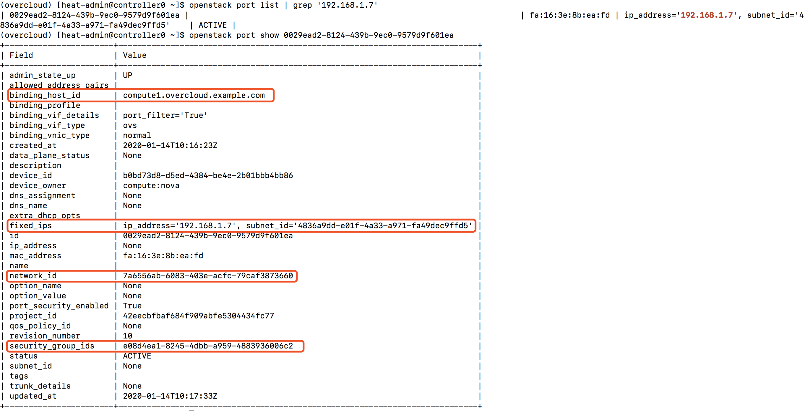
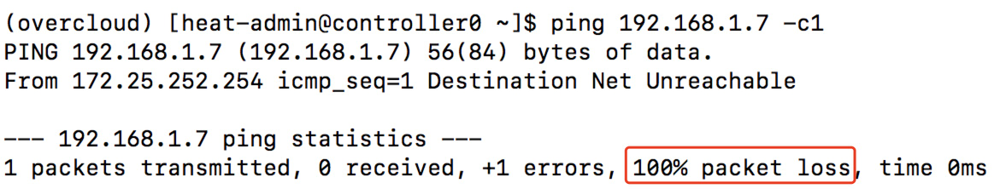

### ml2 ovn
#### 实例是否能从控制节点ping通

##### 查看security group
```
openstack security group list --project $(openstack project list | grep admin | cut -d"|" -f2 | sed -e 's| ||g')
```


##### 查看security group rules，确认有rules允许所希望访问的端口或协议
```
PROJECTID=$(openstack project list | grep admin | cut -d"|" -f2 | sed -e 's| ||g')
echo "project id is ${PROJECTID}"
SECGRPID=$(openstack security group list --project ${PROJECTID} | grep default | cut -d"|" -f2 | sed -e 's| ||g' )
echo "security group id is ${SECGRPID}"
openstack security group rule list ${SECGRPID}

ICMPRULEID=$( openstack security group rule list ${SECGRPID} | grep icmp | cut -d"|" -f2 | sed -e 's| ||g' ) 
echo $ICMPRULEID
openstack security group rule show $ICMPRULEID

SSHRULEID=$( openstack security group rule list ${SECGRPID} | grep "22:22" | cut -d"|" -f2 | sed -e 's| ||g' )
echo "security group id is ${SSHRULEID}"
openstack security group rule show ${SSHRULEID}
```


##### 查看服务器
```
openstack server list
```


##### 查看port详情
```
openstack port list | grep '192.168.1.7'
openstack port show 0029ead2-8124-439b-9ec0-9579d9f601ea
```


##### 在控制节点到fixed ip是否可以ping通
```
ping -c1 192.168.1.7
```


在ovn下，控制节点是不能直接访问实例的fixed ip，如果希望控制节点访问实例的fixed ip，需要借助floating ip

##### 查看实例的浮动ip地址信息
```
openstack floating ip list
openstack floating ip show 747cbd76-fb74-4994-b6bf-8fedc35b7f1a
```


##### ping实例浮动ip地址
```
ping -c1 172.25.250.110 
```
