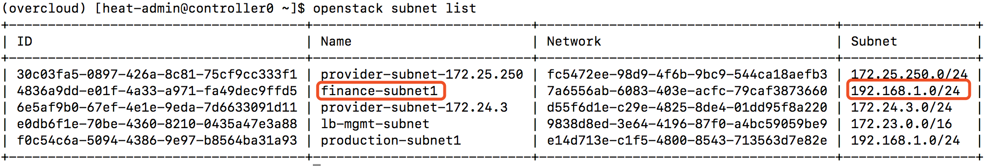
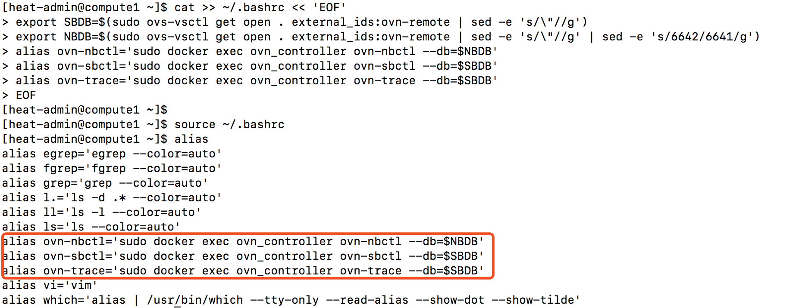
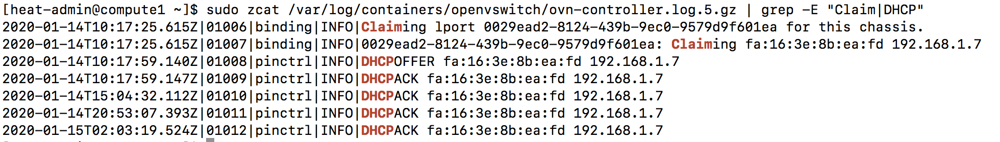
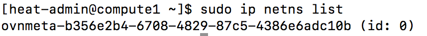
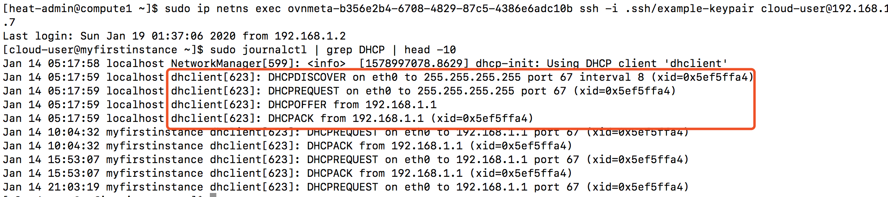
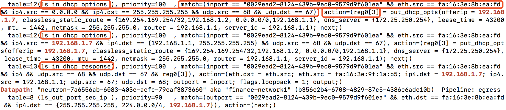
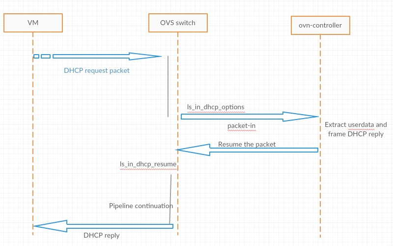

### ml2 ovn
#### 实例DHCP获取ip地址

实例的fixed ip地址通常情况下是通过dhcp获取的，可以通过实例网段确认subnet对应的network id
```
openstack subnet list
```


在ovn下DHCP是通过ovn/ovs实现的，不再借助network namespace和dnsmasq

设置OVN常用命令别名
```
cat >> ~/.bashrc << 'EOF'
export SBDB=$(sudo ovs-vsctl get open . external_ids:ovn-remote | sed -e 's/\"//g')
export NBDB=$(sudo ovs-vsctl get open . external_ids:ovn-remote | sed -e 's/\"//g' | sed -e 's/6642/6641/g')
alias ovn-nbctl='sudo docker exec ovn_controller ovn-nbctl --db=$NBDB'
alias ovn-sbctl='sudo docker exec ovn_controller ovn-sbctl --db=$SBDB'
alias ovn-trace='sudo docker exec ovn_controller ovn-trace --db=$SBDB'
EOF

source ~/.bashrc
alias
```


ovn在计算节点提供DHCP功能
```
zcat /var/log/containers/openvswitch/ovn-controller.log.3.gz
```


在计算节点有ovnmeta-xxxx的net namespace，可以用来登陆实例
```
sudo ip netns list
```


当实例启动时，实例将进行dhcp请求，根据前面的ovn-controller.log文件内容可知，计算节点的OVN Controller对DHCP请求作出响应。通过ovnmeta-xxxx登陆实例
```
sudo ip netns exec ovnmeta-b356e2b4-6708-4829-87c5-4386e6adc10b ssh -i .ssh/example-keypair cloud-user@192.168.1.7
sudo journalctl | grep DHCP | head -10
```


在ovn的logical flow信息中可以看到与目标地址有关的逻辑流
```
ovn-sbctl lflow-list | grep -E "Datapath|192.168.1.7"
Datapath: "neutron-e14d713e-c1f5-4800-8543-713563d7e82e" aka "production-network1" (0a5cd0e3-fd19-4258-880c-aab6dd3bfd47)  Pipeline: ingr
ess
Datapath: "neutron-e14d713e-c1f5-4800-8543-713563d7e82e" aka "production-network1" (0a5cd0e3-fd19-4258-880c-aab6dd3bfd47)  Pipeline: egre
ss
Datapath: "neutron-fc5472ee-98d9-4f6b-9bc9-544ca18aefb3" aka "provider-datacentre" (48f0dd8f-098d-4c30-9ae2-bc03029fca4b)  Pipeline: ingress
Datapath: "neutron-fc5472ee-98d9-4f6b-9bc9-544ca18aefb3" aka "provider-datacentre" (48f0dd8f-098d-4c30-9ae2-bc03029fca4b)  Pipeline: egress
Datapath: "neutron-d55f6d1e-c29e-4825-8de4-01dd95f8a220" aka "provider-storage" (882135cf-ab27-4e8c-8dd9-59bb41bf9c76)  Pipeline: ingress
Datapath: "neutron-d55f6d1e-c29e-4825-8de4-01dd95f8a220" aka "provider-storage" (882135cf-ab27-4e8c-8dd9-59bb41bf9c76)  Pipeline: egress
Datapath: "neutron-7a6556ab-6083-403e-acfc-79caf3873660" aka "finance-network1" (b356e2b4-6708-4829-87c5-4386e6adc10b)  Pipeline: ingress
  table=1 (ls_in_port_sec_ip  ), priority=90   , match=(inport == "0029ead2-8124-439b-9ec0-9579d9f601ea" && eth.src == fa:16:3e:8b:ea:fd && ip4.src == {192.168.1.7}), action=(next;)
  table=2 (ls_in_port_sec_nd  ), priority=90   , match=(inport == "0029ead2-8124-439b-9ec0-9579d9f601ea" && eth.src == fa:16:3e:8b:ea:fd && arp.sha == fa:16:3e:8b:ea:fd && arp.spa == {192.168.1.7}), action=(next;)
  table=11(ls_in_arp_rsp      ), priority=100  , match=(arp.tpa == 192.168.1.7 && arp.op == 1 && inport == "0029ead2-8124-439b-9ec0-9579d9f601ea"), action=(next;)
  table=11(ls_in_arp_rsp      ), priority=50   , match=(arp.tpa == 192.168.1.7 && arp.op == 1), action=(eth.dst = eth.src; eth.src = fa:16:3e:8b:ea:fd; arp.op = 2; /* ARP reply */ arp.tha = arp.sha; arp.sha = fa:16:3e:8b:ea:fd; arp.tpa = arp.spa; arp.spa = 192.168.1.7; outport = inport; flags.loopback = 1; output;)
Datapath: "neutron-7a6556ab-6083-403e-acfc-79caf3873660" aka "finance-network1" (b356e2b4-6708-4829-87c5-4386e6adc10b)  Pipeline: egress
  table=8 (ls_out_port_sec_ip ), priority=90   , match=(outport == "0029ead2-8124-439b-9ec0-9579d9f601ea" && eth.dst == fa:16:3e:8b:ea:fd && ip4.dst == {255.255.255.255, 224.0.0.0/4, 192.168.1.7}), action=(next;)
Datapath: "neutron-613a09c2-f69a-46dd-9df8-8cd731f17cec" aka "router-1" (dc271de2-2cac-4567-b0c2-674656833a65)  Pipeline: ingress
  table=4 (lr_in_dnat         ), priority=100  , match=(ip && ip4.dst == 172.25.250.110 && inport == "lrp-7ea6d0a6-fb59-47d1-9a33-8d4a595683ee"), action=(ct_dnat(192.168.1.7);)
  table=8 (lr_in_arp_resolve  ), priority=100  , match=(outport == "lrp-a3fe12c3-8987-487c-9e83-a90e168c08a5" && reg0 == 192.168.1.7), action=(eth.dst = fa:16:3e:8b:ea:fd; next;)
  table=9 (lr_in_gw_redirect  ), priority=100  , match=(ip4.src == 192.168.1.7 && outport == "lrp-7ea6d0a6-fb59-47d1-9a33-8d4a595683ee"), action=(next;)
Datapath: "neutron-613a09c2-f69a-46dd-9df8-8cd731f17cec" aka "router-1" (dc271de2-2cac-4567-b0c2-674656833a65)  Pipeline: egress
  table=0 (lr_out_undnat      ), priority=100  , match=(ip && ip4.src == 192.168.1.7 && outport == "lrp-7ea6d0a6-fb59-47d1-9a33-8d4a595683ee"), action=(eth.src = fa:16:3e:60:d8:63; ct_dnat;)
  table=1 (lr_out_snat        ), priority=33   , match=(ip && ip4.src == 192.168.1.7 && outport == "lrp-7ea6d0a6-fb59-47d1-9a33-8d4a595683ee"), action=(eth.src = fa:16:3e:60:d8:63; ct_snat(172.25.250.110);)
Datapath: "neutron-9838d8ed-3e64-4196-87f0-a4bc59059be9" aka "lb-mgmt-net" (f03e8ce2-512c-475f-9215-104a6f90dd9c)  Pipeline: ingress
Datapath: "neutron-9838d8ed-3e64-4196-87f0-a4bc59059be9" aka "lb-mgmt-net" (f03e8ce2-512c-475f-9215-104a6f90dd9c)  Pipeline: egress
```

其中与dhcp处理有关的logical flow是以下这几条flow。
```
  table=12(ls_in_dhcp_options ), priority=100  , match=(inport == "0029ead2-8124-439b-9ec0-9579d9f601ea" && eth.src == fa:16:3e:8b:ea:fd && ip4.src == 0.0.0.0 && ip4.dst == 255.255.255.255 && udp.src == 68 && udp.dst == 67), action=(reg0[3] = put_dhcp_opts(offerip = 192.168.1.7, classless_static_route = {169.254.169.254/32,192.168.1.2, 0.0.0.0/0,192.168.1.1}, dns_server = {172.25.250.254}, lease_time = 43200, mtu = 1442, netmask = 255.255.255.0, router = 192.168.1.1, server_id = 192.168.1.1); next;)
  table=12(ls_in_dhcp_options ), priority=100  , match=(inport == "0029ead2-8124-439b-9ec0-9579d9f601ea" && eth.src == fa:16:3e:8b:ea:fd && ip4.src == 192.168.1.7 && ip4.dst == {192.168.1.1, 255.255.255.255} && udp.src == 68 && udp.dst == 67), action=(reg0[3] = put_dhcp_opts(offerip = 192.168.1.7, classless_static_route = {169.254.169.254/32,192.168.1.2, 0.0.0.0/0,192.168.1.1}, dns_server = {172.25.250.254}, lease_time = 43200, mtu = 1442, netmask = 255.255.255.0, router = 192.168.1.1, server_id = 192.168.1.1); next;)
  table=13(ls_in_dhcp_response), priority=100  , match=(inport == "0029ead2-8124-439b-9ec0-9579d9f601ea" && eth.src == fa:16:3e:8b:ea:fd && ip4 && udp.src == 68 && udp.dst == 67 && reg0[3]), action=(eth.dst = eth.src; eth.src = fa:16:3e:9f:1a:b5; ip4.dst = 192.168.1.7; ip4.src = 192.168.1.1; udp.src = 67; udp.dst = 68; outport = inport; flags.loopback = 1; output;)
```


```
  table=12(ls_in_dhcp_options ), priority=100  , match=(inport == "0029ead2-8124-439b-9ec0-9579d9f601ea" && eth.src == fa:16:3e:8b:ea:fd && ip4.src == 0.0.0.0 && ip4.dst == 255.255.255.255 && udp.src == 68 && udp.dst == 67), action=(reg0[3] = put_dhcp_opts(offerip = 192.168.1.7, classless_static_route = {169.254.169.254/32,192.168.1.2, 0.0.0.0/0,192.168.1.1}, dns_server = {172.25.250.254}, lease_time = 43200, mtu = 1442, netmask = 255.255.255.0, router = 192.168.1.1, server_id = 192.168.1.1); next;)
```
这条Logical Flows相当于，名为0029ead2-8124-439b-9ec0-9579d9f601ea的端口，如果: th.src == fa:16:3e:8b:ea:fd && ip4.src == 0.0.0.0 && ip4.dst == 255.255.255.255 && udp.src == 68 && udp.dst == 67 的话，相当于从这个口发出了 DHCPDISCOVER请求，就执行put_dhcp_opts的action。

ovn的put_dhcp_options翻译到ovs就是，controller(userdata=...)
```
sudo ovs-ofctl dump-flows br-int | grep "ea:fd" | grep 67 | grep 68 | grep 0.0.0.0 
...
 cookie=0xb68ca1fa, duration=420458.377s, table=20, n_packets=2, n_bytes=684, idle_age=65534, hard_age=65534, priority=100,udp,reg14=0x4,metadata=0x4,dl_src=fa:16:3e:8b:ea:fd,nw_src=0.0.0.0,nw_dst=255.255.255.255,tp_src=68,tp_dst=67 actions=controller(userdata=00.00.00.02.00.00.00.00.00.01.de.10.00.00.00.63.c0.a8.01.07.79.0e.20.a9.fe.a9.fe.c0.a8.01.02.00.c0.a8.01.01.06.04.ac.19.fa.fe.33.04.00.00.a8.c0.1a.02.05.a2.01.04.ff.ff.ff.00.03.04.c0.a8.01.01.36.04.c0.a8.01.01,pause),resubmit(,21)
```

```
  table=12(ls_in_dhcp_options ), priority=100  , match=(inport == "0029ead2-8124-439b-9ec0-9579d9f601ea" && eth.src == fa:16:3e:8b:ea:fd && ip4.src == 192.168.1.7 && ip4.dst == {192.168.1.1, 255.255.255.255} && udp.src == 68 && udp.dst == 67), action=(reg0[3] = put_dhcp_opts(offerip = 192.168.1.7, classless_static_route = {169.254.169.254/32,192.168.1.2, 0.0.0.0/0,192.168.1.1}, dns_server = {172.25.250.254}, lease_time = 43200, mtu = 1442, netmask = 255.255.255.0, router = 192.168.1.1, server_id = 192.168.1.1); next;)
```
这条Logical Flows相当于虚拟机发出DHCPREQUEST

```
  table=13(ls_in_dhcp_response), priority=100  , match=(inport == "0029ead2-8124-439b-9ec0-9579d9f601ea" && eth.src == fa:16:3e:8b:ea:fd && ip4 && udp.src == 68 && udp.dst == 67 && reg0[3]), action=(eth.dst = eth.src; eth.src = fa:16:3e:9f:1a:b5; ip4.dst = 192.168.1.7; ip4.src = 192.168.1.1; udp.src = 67; udp.dst = 68; outport = inport; flags.loopback = 1; output;)
```
这条Logical Flows相当于为虚拟机提供DHCPACK

流程如下
```
