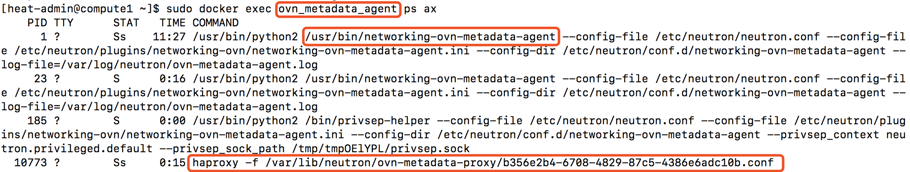
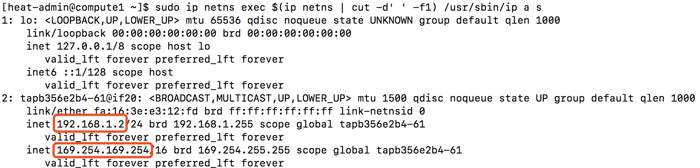

### ml2 ovn
#### 实例如何获取metadata

实例可以通过config drive或者metadata agent获取实例metadata

ovn在每个计算节点上运行着ovn metadata agent

通过metadata agent访问metadata服务地址为 169.254.169.254:80
```
[heat-admin@compute1 ~]$ sudo ip netns exec ovnmeta-b356e2b4-6708-4829-87c5-4386e6adc10b ssh -i ~/.ssh/example-keypair cloud-user@192.168.1.7 'curl 169.254.169.254' 
2007-01-19
2007-03-01
2007-08-29
2007-10-10
2007-12-15
2008-02-01
2008-09-01
2009-04-04
```


虚拟机通过计算节点 ovn_metadata_agent内的haproxy将虚拟机对metadata的请求通过unix domain socket转发给networking-ovn-metadata-agent，再转发给nova-api-metadata
```
[heat-admin@compute1 ~]$ sudo docker exec ovn_metadata_agent ps ax
    PID TTY      STAT   TIME COMMAND
      1 ?        Ss    11:27 /usr/bin/python2 /usr/bin/networking-ovn-metadata-agent --config-file /etc/neutron/neutron.conf --config-file /etc/neutron/plugins/networking-ovn/networking-ovn-metadata-agent.ini --config-dir /etc/neutron/conf.d/networking-ovn-metadata-agent --log-file=/var/log/neutron/ovn-metadata-agent.log
     23 ?        S      0:16 /usr/bin/python2 /usr/bin/networking-ovn-metadata-agent --config-file /etc/neutron/neutron.conf --config-file /etc/neutron/plugins/networking-ovn/networking-ovn-metadata-agent.ini --config-dir /etc/neutron/conf.d/networking-ovn-metadata-agent --log-file=/var/log/neutron/ovn-metadata-agent.log
    185 ?        S      0:00 /usr/bin/python2 /bin/privsep-helper --config-file /etc/neutron/neutron.conf --config-file /etc/neutron/plugins/networking-ovn/networking-ovn-metadata-agent.ini --config-dir /etc/neutron/conf.d/networking-ovn-metadata-agent --privsep_context neutron.privileged.default --privsep_sock_path /tmp/tmpOElYPL/privsep.sock
  10773 ?        Ss     0:15 haproxy -f /var/lib/neutron/ovn-metadata-proxy/b356e2b4-6708-4829-87c5-4386e6adc10b.conf
```



容器ovn_metadata_agent里的haproxy的配置文件，可以看到对80的访问，会转发给unix socket /var/lib/neutron/metadata_proxy
```
[heat-admin@compute1 ~]$ sudo docker exec ovn_metadata_agent cat /var/lib/neutron/ovn-metadata-proxy/b356e2b4-6708-4829-87c5-4386e6adc10b.conf 

global
    log         /dev/log local0 info
    user        neutron
    group       neutron
    maxconn     1024
    pidfile     /var/lib/neutron/external/pids/b356e2b4-6708-4829-87c5-4386e6adc10b.pid
    daemon

defaults
    log global
    mode http
    option httplog
    option dontlognull
    option http-server-close
    option forwardfor
    retries                 3
    timeout http-request    30s
    timeout connect         30s
    timeout client          32s
    timeout server          32s
    timeout http-keep-alive 30s

listen listener
    bind 0.0.0.0:80
    server metadata /var/lib/neutron/metadata_proxy
    http-request add-header X-OVN-Network-ID b356e2b4-6708-4829-87c5-4386e6adc10b
```


/var/lib/neutron/metadata_proxy是用于haproxy和ovn metadata agent间IPC通信的unix socket
```
[heat-admin@compute1 ~]$ sudo docker exec ovn_metadata_agent ls -l /var/lib/neutron/metadata_proxy 
srw-r--r--. 1 neutron neutron 0 Jan 14 01:12 /var/lib/neutron/metadata_proxy
```


在启动实例时，实例内会增加169.254.169.254的路由
```
[heat-admin@compute1 ~]$ sudo ip netns exec ovnmeta-b356e2b4-6708-4829-87c5-4386e6adc10b ssh -i ~/.ssh/example-keypair cloud-user@192.168.1.7 '/usr/sbin/ip r s' 
default via 192.168.1.1 dev eth0 proto dhcp metric 100 
169.254.169.254 via 192.168.1.2 dev eth0 proto dhcp metric 100 
192.168.1.0/24 dev eth0 proto kernel scope link src 192.168.1.7 metric 100 
```


路由指向ovnmeta-xxxx namespace里的ip地址，同一个设备上还启用着169.254.169.254
```
[heat-admin@compute1 ~]$ sudo ip netns exec $(ip netns | cut -d' ' -f1) /usr/sbin/ip a s 
1: lo: <LOOPBACK,UP,LOWER_UP> mtu 65536 qdisc noqueue state UNKNOWN group default qlen 1000
    link/loopback 00:00:00:00:00:00 brd 00:00:00:00:00:00
    inet 127.0.0.1/8 scope host lo
       valid_lft forever preferred_lft forever
    inet6 ::1/128 scope host 
       valid_lft forever preferred_lft forever
2: tapb356e2b4-61@if20: <BROADCAST,MULTICAST,UP,LOWER_UP> mtu 1500 qdisc noqueue state UP group default qlen 1000
    link/ether fa:16:3e:e3:12:fd brd ff:ff:ff:ff:ff:ff link-netnsid 0
    inet 192.168.1.2/24 brd 192.168.1.255 scope global tapb356e2b4-61
       valid_lft forever preferred_lft forever
    inet 169.254.169.254/16 brd 169.254.255.255 scope global tapb356e2b4-61
       valid_lft forever preferred_lft forever
```


