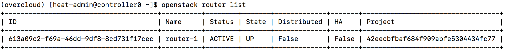
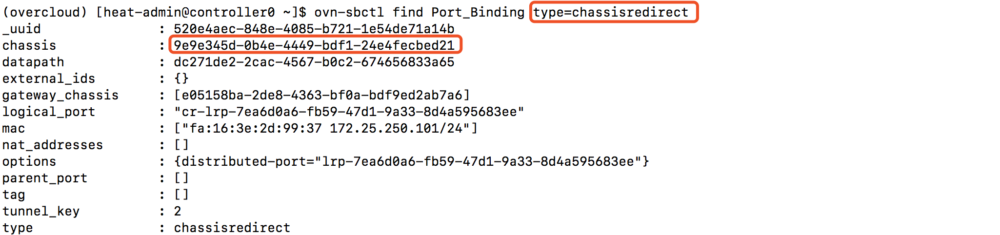
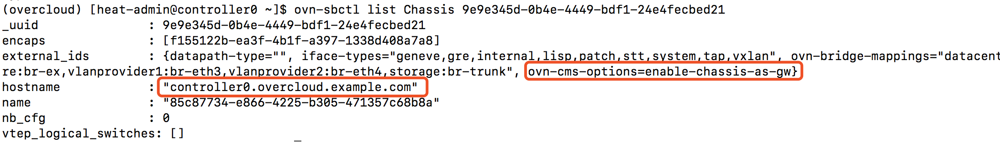
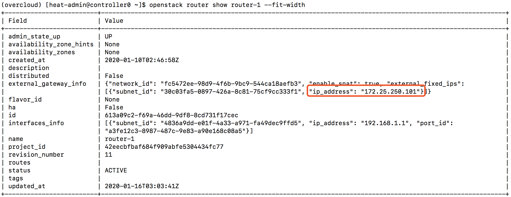
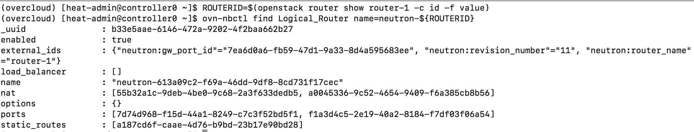
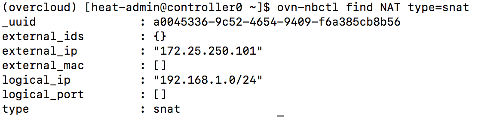
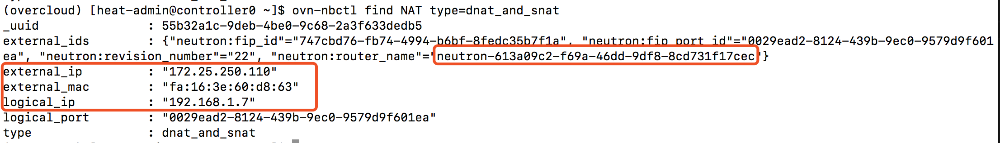
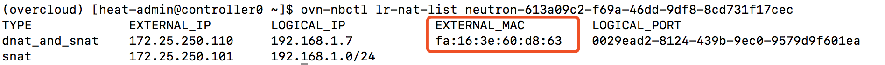

### ml2 ovn
#### 实例路由

OpenStack neutron的router相当于软件路由器，实现租户间网络路由，租户南北向流量


对于ovn来说，所有的功能都是透过ovs实现的，L3也是通过ovs实现的。

首先查找Gateway Chassis在哪里，Chassis是OVN下的概念，可以映射到主机上

```
 [heat-admin@controller0 ~]$ ovn-sbctl find Port_Binding type=chassisredirect
_uuid               : 520e4aec-848e-4085-b721-1e54de71a14b
chassis             : 9e9e345d-0b4e-4449-bdf1-24e4fecbed21
datapath            : dc271de2-2cac-4567-b0c2-674656833a65
external_ids        : {}
gateway_chassis     : [e05158ba-2de8-4363-bf0a-bdf9ed2ab7a6]
logical_port        : "cr-lrp-7ea6d0a6-fb59-47d1-9a33-8d4a595683ee"
mac                 : ["fa:16:3e:2d:99:37 172.25.250.101/24"]
nat_addresses       : []
options             : {distributed-port="lrp-7ea6d0a6-fb59-47d1-9a33-8d4a595683ee"}
parent_port         : []
tag                 : []
tunnel_key          : 2
type                : chassisredirect
```


查找Gateway Chassis对应的主机
```
[heat-admin@controller0 ~]$ ovn-sbctl list Chassis 9e9e345d-0b4e-4449-bdf1-24e4fecbed21
_uuid               : 9e9e345d-0b4e-4449-bdf1-24e4fecbed21
encaps              : [f155122b-ea3f-4b1f-a397-1338d408a7a8]
external_ids        : {datapath-type="", iface-types="geneve,gre,internal,lisp,patch,stt,system,tap,vxlan", ovn-bridge-mappings="datacentre:br-ex,vlanprovider1:br-eth3,vlanprovider2:br-eth4,storage:br-trunk", ovn-cms-options=enable-chassis-as-gw}
hostname            : "controller0.overcloud.example.com"
name                : "85c87734-e866-4225-b305-471357c68b8a"
nb_cfg              : 0
vtep_logical_switches: []
```


检查router的external_gateway_info和ip_address信息，查看router-1
```
[heat-admin@controller0 ~]$ openstack router show router-1 --fit-width
+-------------------------+-------------------------------------------------------------------------------------------------------------+
| Field                   | Value                                                                                                       |
+-------------------------+-------------------------------------------------------------------------------------------------------------+
| admin_state_up          | UP                                                                                                          |
| availability_zone_hints | None                                                                                                        |
| availability_zones      | None                                                                                                        |
| created_at              | 2020-01-10T02:46:58Z                                                                                        |
| description             |                                                                                                             |
| distributed             | False                                                                                                       |
| external_gateway_info   | {"network_id": "fc5472ee-98d9-4f6b-9bc9-544ca18aefb3", "enable_snat": true, "external_fixed_ips":           |
|                         | [{"subnet_id": "30c03fa5-0897-426a-8c81-75cf9cc333f1", "ip_address": "172.25.250.101"}]}                    |
| flavor_id               | None                                                                                                        |
| ha                      | False                                                                                                       |
| id                      | 613a09c2-f69a-46dd-9df8-8cd731f17cec                                                                        |
| interfaces_info         | [{"subnet_id": "4836a9dd-e01f-4a33-a971-fa49dec9ffd5", "ip_address": "192.168.1.1", "port_id":              |
|                         | "a3fe12c3-8987-487c-9e83-a90e168c08a5"}]                                                                    |
| name                    | router-1                                                                                                    |
| project_id              | 42eecbfbaf684f909abfe5304434fc77                                                                            |
| revision_number         | 11                                                                                                          |
| routes                  |                                                                                                             |
| status                  | ACTIVE                                                                                                      |
| tags                    |                                                                                                             |
| updated_at              | 2020-01-16T03:03:41Z                                                                                        |
+-------------------------+-------------------------------------------------------------------------------------------------------------+
```



Use neutron router UUID with prefix neutron- parameter to collect routing details from Logical_Router table
在neutron router UUID前加上neutron-前缀，从Logical Router获得路由详细信息
```
ROUTERID=$(openstack router show router-1 -c id -f value)
ovn-nbctl find Logical_Router name=neutron-${ROUTERID}

_uuid               : b33e5aae-6146-472a-9202-4f2baa662b27
enabled             : true
external_ids        : {"neutron:gw_port_id"="7ea6d0a6-fb59-47d1-9a33-8d4a595683ee", "neutron:revision_number"="11", "neutron:router_name"="router-1"}
load_balancer       : []
name                : "neutron-613a09c2-f69a-46dd-9df8-8cd731f17cec"
nat                 : [55b32a1c-9deb-4be0-9c68-2a3f633dedb5, a0045336-9c52-4654-9409-f6a385cb8b56]
options             : {}
ports               : [7d74d968-f15d-44a1-8249-c7c3f52bd5f1, f1a3d4c5-2e19-40a2-8184-f7df03f06a54]
static_routes       : [a187cd6f-caae-4d76-b9bd-23b17e90bd28]

```


From OVN NAT northbound table, verify SNAT mapping details.
从ovn northbound NAT表，检查SNAT信息
```
[heat-admin@controller0 ~]$ ovn-nbctl find NAT type=snat
_uuid               : a0045336-9c52-4654-9409-f6a385cb8b56
external_ids        : {}
external_ip         : "172.25.250.101"
external_mac        : []
logical_ip          : "192.168.1.0/24"
logical_port        : []
type                : snat
```


如果已绑定浮动IP，可查询northbound库里的dnat_and_snat类型
```
[heat-admin@controller0 ~]$ ovn-nbctl find NAT type=dnat_and_snat
_uuid               : 55b32a1c-9deb-4be0-9c68-2a3f633dedb5
external_ids        : {"neutron:fip_id"="747cbd76-fb74-4994-b6bf-8fedc35b7f1a", "neutron:fip_port_id"="0029ead2-8124-439b-9ec0-9579d9f601ea", "neutron:revision_number"="22", "neutron:router_name"="neutron-613a09c2-f69a-46dd-9df8-8cd731f17cec"}
external_ip         : "172.25.250.110"
external_mac        : "fa:16:3e:60:d8:63"
logical_ip          : "192.168.1.7"
logical_port        : "0029ead2-8124-439b-9ec0-9579d9f601ea"
type                : dnat_and_snat
```


通过另外一个命令确认dnat_and_snat绑定external mac
```
[heat-admin@controller0 ~]$ ovn-nbctl lr-nat-list neutron-613a09c2-f69a-46dd-9df8-8cd731f17cec
TYPE             EXTERNAL_IP        LOGICAL_IP            EXTERNAL_MAC         LOGICAL_PORT
dnat_and_snat    172.25.250.110     192.168.1.7           fa:16:3e:60:d8:63    0029ead2-8124-439b-9ec0-9579d9f601ea
snat             172.25.250.101     192.168.1.0/24
```


未完，待续