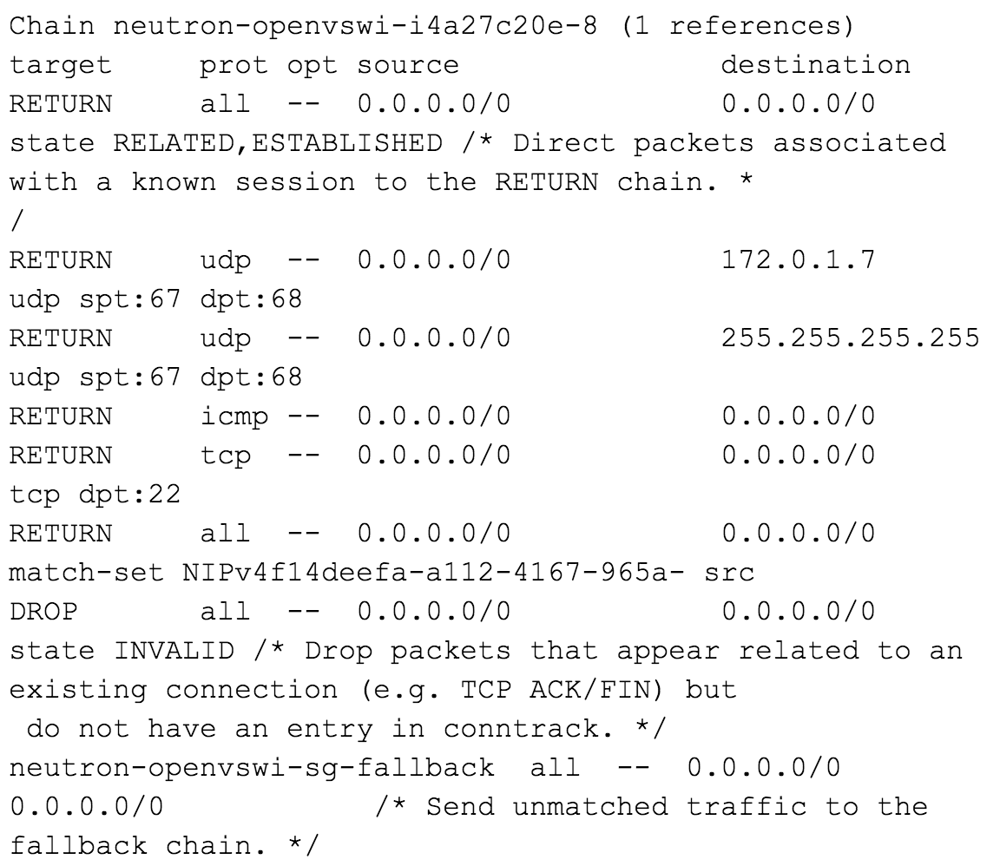

### ml2 ovn
#### OVN基于conntrack实现的安全组规则

ml2 ovn下默认通过conntrack实现安全组规则

查看安全组规则
```

```


neutron-openvswi-FORWARD下每个实例会有一对规则，下一步处理会进入neutron-openvswi-sg-chain Chain


--physdev-out tap4a27c20e-8f这条规则定义了来自虚拟机的流量发到neutron-openvswi-i4a27c20e-8(VM OUT)<br>
--physdev-in tap4a27c20e-8这条规则定义了发往虚拟机的流量发到neutron-openvswi-o4a27c20e-8(VM IN)

neutron-openvswi-sg-chain下一步跳转到VM对应的Chain neutron-openvswi-i4a27c20e-8和neutron-openvswi-o4a27c20e-8


neutron-openvswi-i4a27c20e-8处理来自虚拟机的流量


neutron-openvswi-o4a27c20e-8处理发给虚拟机的流量


参见：
[OpenStack Security Groups using OVN ACLs](https://blog.russellbryant.net/2015/10/22/openstack-security-groups-using-ovn-acls/)
[Implementing Security Groups in OpenStack using OVN Port Groups](http://dani.foroselectronica.es/implementing-security-groups-in-openstack-using-ovn-port-groups-478/)