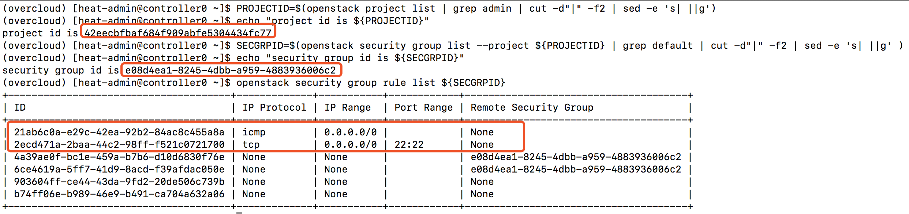
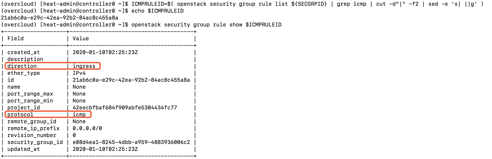
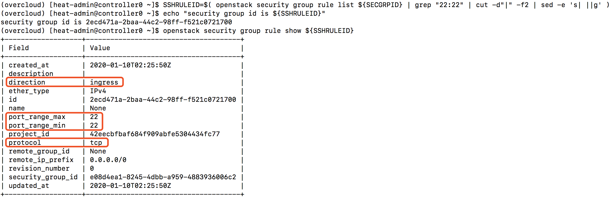
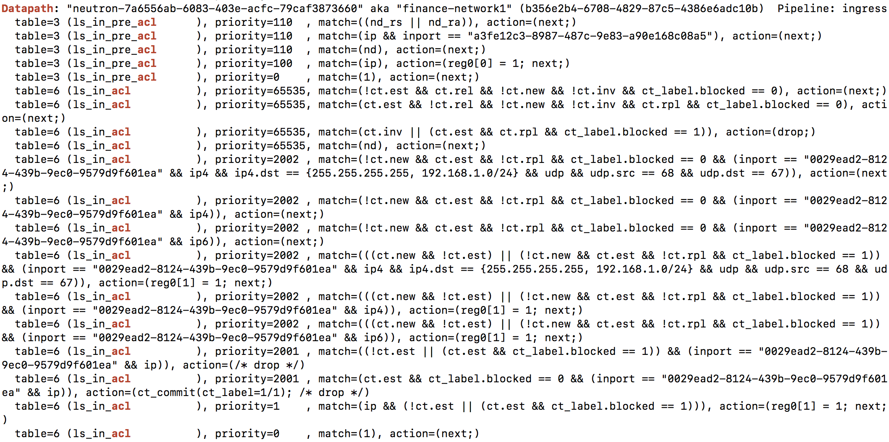

### ml2 ovn
#### OVN基于conntrack实现的安全组规则

ml2 ovn下默认通过conntrack实现安全组规则

##### 查看security group
```
openstack security group list --project $(openstack project list | grep admin | cut -d"|" -f2 | sed -e 's| ||g')
```


##### 查看security group rules，确认有rules允许所希望访问的端口或协议
```
PROJECTID=$(openstack project list | grep admin | cut -d"|" -f2 | sed -e 's| ||g')
echo "project id is ${PROJECTID}"
SECGRPID=$(openstack security group list --project ${PROJECTID} | grep default | cut -d"|" -f2 | sed -e 's| ||g' )
echo "security group id is ${SECGRPID}"
openstack security group rule list ${SECGRPID}

ICMPRULEID=$( openstack security group rule list ${SECGRPID} | grep icmp | cut -d"|" -f2 | sed -e 's| ||g' ) 
echo $ICMPRULEID
openstack security group rule show $ICMPRULEID

SSHRULEID=$( openstack security group rule list ${SECGRPID} | grep "22:22" | cut -d"|" -f2 | sed -e 's| ||g' )
echo "security group id is ${SSHRULEID}"
openstack security group rule show ${SSHRULEID}
```




设置必要环境变量和命令别名
```
cat >> ~/.bashrc << EOF
export SBDB=$(sudo ovs-vsctl get open . external_ids:ovn-remote | sed -e 's/\"//g')
export NBDB=$(sudo ovs-vsctl get open . external_ids:ovn-remote | sed -e 's/\"//g' | sed -e 's/6642/6641/g')
alias ovn-nbctl='sudo docker exec ovn_controller ovn-nbctl --db=$NBDB'
alias ovn-sbctl='sudo docker exec ovn_controller ovn-sbctl --db=$SBDB'
alias ovn-trace='sudo docker exec ovn_controller ovn-trace --db=$SBDB'
EOF

source ~/.bashrc
alias
```

了解实例所在的网络，其中finance-network1是实例所在网络
```
ovn-nbctl show | grep switch
switch b2cc3860-13f9-4eeb-b328-10dbc1f1b131 (neutron-d55f6d1e-c29e-4825-8de4-01dd95f8a220) (aka provider-storage)
switch aca840be-670a-4eb3-9b36-4246c0eabb6c (neutron-9838d8ed-3e64-4196-87f0-a4bc59059be9) (aka lb-mgmt-net)
switch c5b32043-cd23-41ac-9197-ea41917870bb (neutron-e14d713e-c1f5-4800-8543-713563d7e82e) (aka production-network1)
switch 153db687-27fe-4f90-a3f0-2958c373dcc2 (neutron-7a6556ab-6083-403e-acfc-79caf3873660) (aka finance-network1)
switch f0f71887-2544-4f29-b46c-04b0aa0b2e52 (neutron-fc5472ee-98d9-4f6b-9bc9-544ca18aefb3) (aka provider-datacentre)
```


查看ovn nbdb acl规则，from-lport对应来自虚拟机的数据包，to-lport对应发给虚拟机的数据包
```
[heat-admin@controller0 ~]$ ovn-nbctl acl-list $(ovn-nbctl show | grep finance-network1 | cut -d' ' -f2)
from-lport  1002 (inport == "0029ead2-8124-439b-9ec0-9579d9f601ea" && ip4) allow-related
from-lport  1002 (inport == "0029ead2-8124-439b-9ec0-9579d9f601ea" && ip4 && ip4.dst == {255.255.255.255, 192.168.1.0/24} && udp && udp.src == 68 && udp.dst == 67) allow
from-lport  1002 (inport == "0029ead2-8124-439b-9ec0-9579d9f601ea" && ip6) allow-related
from-lport  1001 (inport == "0029ead2-8124-439b-9ec0-9579d9f601ea" && ip) drop
  to-lport  1002 (outport == "0029ead2-8124-439b-9ec0-9579d9f601ea" && ip4 && ip4.src == $as_ip4_e08d4ea1_8245_4dbb_a959_4883936006c2) allow-related
  to-lport  1002 (outport == "0029ead2-8124-439b-9ec0-9579d9f601ea" && ip4 && ip4.src == 0.0.0.0/0 && icmp4) allow-related
  to-lport  1002 (outport == "0029ead2-8124-439b-9ec0-9579d9f601ea" && ip4 && ip4.src == 0.0.0.0/0 && tcp && tcp.dst == 22) allow-related
  to-lport  1002 (outport == "0029ead2-8124-439b-9ec0-9579d9f601ea" && ip6 && ip6.src == $as_ip6_e08d4ea1_8245_4dbb_a959_4883936006c2) allow-related
  to-lport  1001 (outport == "0029ead2-8124-439b-9ec0-9579d9f601ea" && ip) drop
```


查看与ACL有关的Logical Flow
```
 [heat-admin@controller0 ~]$ ovn-sbctl lflow-list  | grep -E "Datapath|acl"
 ...
Datapath: "neutron-7a6556ab-6083-403e-acfc-79caf3873660" aka "finance-network1" (b356e2b4-6708-4829-87c5-4386e6adc10b)  Pipeline: ingress
  table=3 (ls_in_pre_acl      ), priority=110  , match=((nd_rs || nd_ra)), action=(next;)
  table=3 (ls_in_pre_acl      ), priority=110  , match=(ip && inport == "a3fe12c3-8987-487c-9e83-a90e168c08a5"), action=(next;)
  table=3 (ls_in_pre_acl      ), priority=110  , match=(nd), action=(next;)
  table=3 (ls_in_pre_acl      ), priority=100  , match=(ip), action=(reg0[0] = 1; next;)
  table=3 (ls_in_pre_acl      ), priority=0    , match=(1), action=(next;)
  table=6 (ls_in_acl          ), priority=65535, match=(!ct.est && ct.rel && !ct.new && !ct.inv && ct_label.blocked == 0), action=(next;)
  table=6 (ls_in_acl          ), priority=65535, match=(ct.est && !ct.rel && !ct.new && !ct.inv && ct.rpl && ct_label.blocked == 0), action=(next;)
  table=6 (ls_in_acl          ), priority=65535, match=(ct.inv || (ct.est && ct.rpl && ct_label.blocked == 1)), action=(drop;)
  table=6 (ls_in_acl          ), priority=65535, match=(nd), action=(next;)
  table=6 (ls_in_acl          ), priority=2002 , match=(!ct.new && ct.est && !ct.rpl && ct_label.blocked == 0 && (inport == "0029ead2-8124-439b-9ec0-9579d9f601ea" && ip4 && ip4.dst == {255.255.255.255, 192.168.1.0/24} && udp && udp.src == 68 && udp.dst == 67)), action=(next;)
  table=6 (ls_in_acl          ), priority=2002 , match=(!ct.new && ct.est && !ct.rpl && ct_label.blocked == 0 && (inport == "0029ead2-8124-439b-9ec0-9579d9f601ea" && ip4)), action=(next;)
  table=6 (ls_in_acl          ), priority=2002 , match=(!ct.new && ct.est && !ct.rpl && ct_label.blocked == 0 && (inport == "0029ead2-8124-439b-9ec0-9579d9f601ea" && ip6)), action=(next;)
  table=6 (ls_in_acl          ), priority=2002 , match=(((ct.new && !ct.est) || (!ct.new && ct.est && !ct.rpl && ct_label.blocked == 1)) && (inport == "0029ead2-8124-439b-9ec0-9579d9f601ea" && ip4 && ip4.dst == {255.255.255.255, 192.168.1.0/24} && udp && udp.src == 68 && udp.dst == 67)), action=(reg0[1] = 1; next;)
  table=6 (ls_in_acl          ), priority=2002 , match=(((ct.new && !ct.est) || (!ct.new && ct.est && !ct.rpl && ct_label.blocked == 1)) && (inport == "0029ead2-8124-439b-9ec0-9579d9f601ea" && ip4)), action=(reg0[1] = 1; next;)
  table=6 (ls_in_acl          ), priority=2002 , match=(((ct.new && !ct.est) || (!ct.new && ct.est && !ct.rpl && ct_label.blocked == 1)) && (inport == "0029ead2-8124-439b-9ec0-9579d9f601ea" && ip6)), action=(reg0[1] = 1; next;)
  table=6 (ls_in_acl          ), priority=2001 , match=((!ct.est || (ct.est && ct_label.blocked == 1)) && (inport == "0029ead2-8124-439b-9ec0-9579d9f601ea" && ip)), action=(/* drop */)
  table=6 (ls_in_acl          ), priority=2001 , match=(ct.est && ct_label.blocked == 0 && (inport == "0029ead2-8124-439b-9ec0-9579d9f601ea" && ip)), action=(ct_commit(ct_label=1/1); /* drop */)
  table=6 (ls_in_acl          ), priority=1    , match=(ip && (!ct.est || (ct.est && ct_label.blocked == 1))), action=(reg0[1] = 1; next;)
  table=6 (ls_in_acl          ), priority=0    , match=(1), action=(next;)
...
```


未完，待续

参见：
[OpenStack Security Groups using OVN ACLs](https://blog.russellbryant.net/2015/10/22/openstack-security-groups-using-ovn-acls/)
[Implementing Security Groups in OpenStack using OVN Port Groups](http://dani.foroselectronica.es/implementing-security-groups-in-openstack-using-ovn-port-groups-478/)