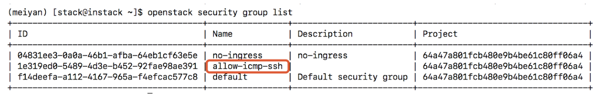
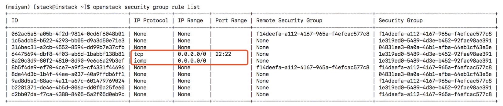
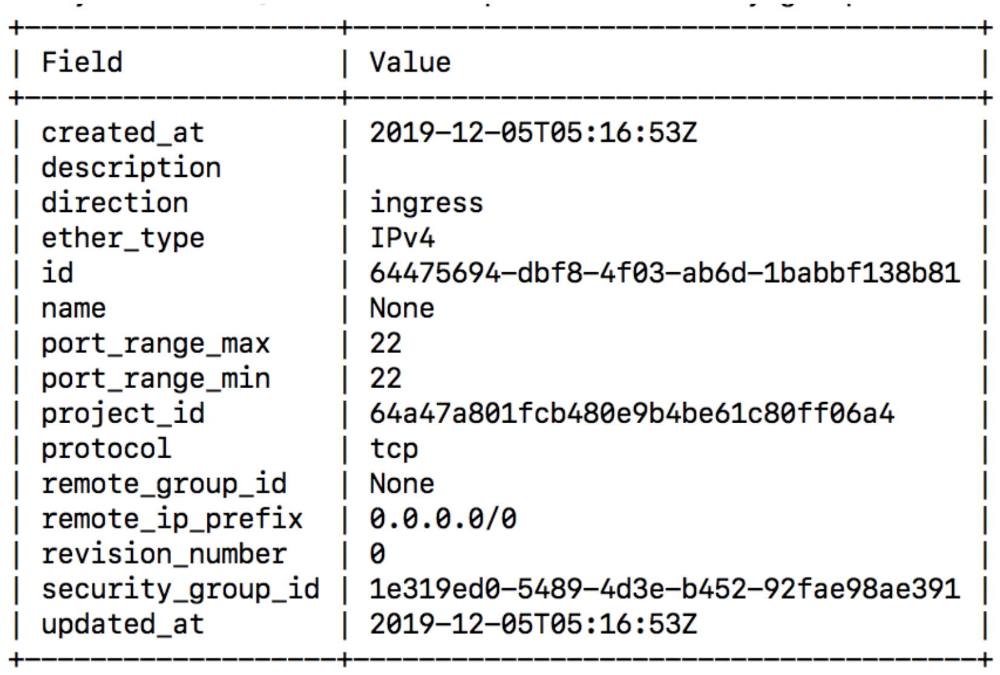
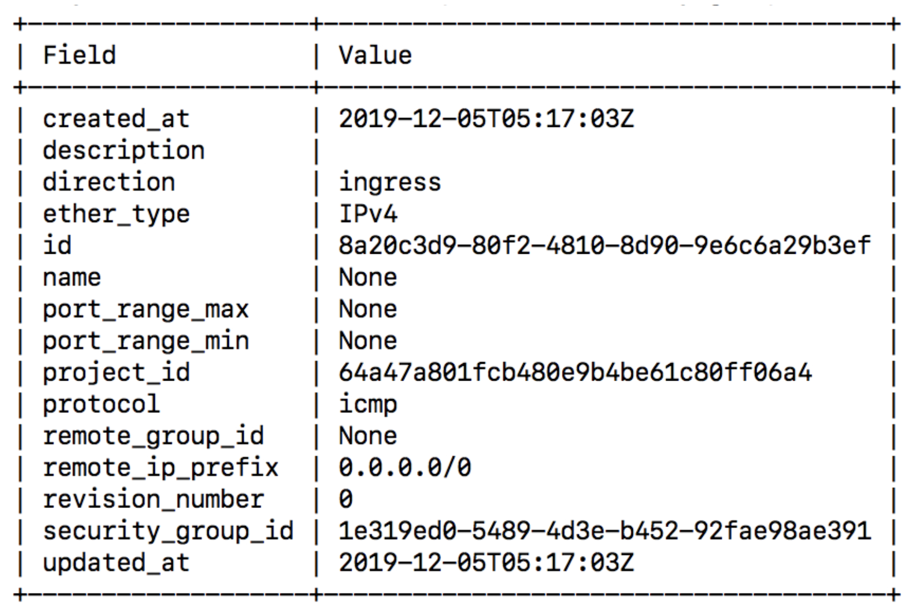
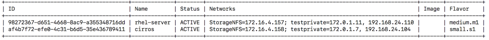
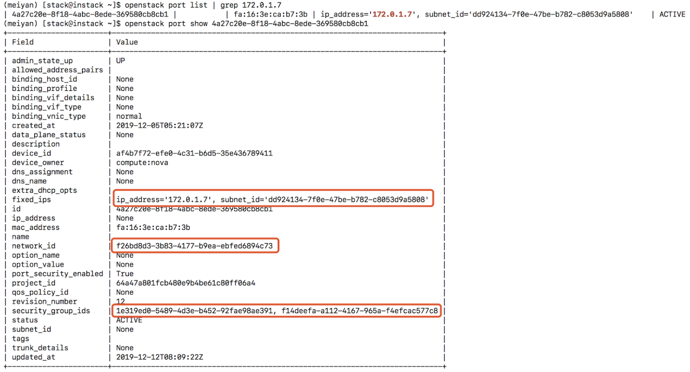
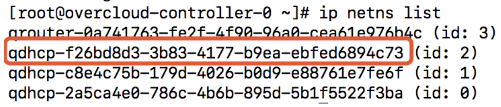
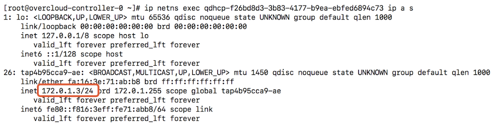
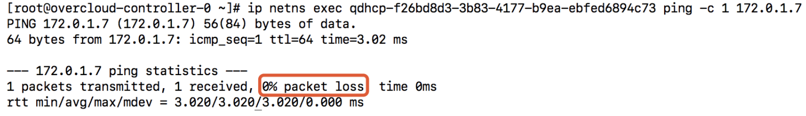

### ml2 ovs
#### 实例是否能从控制节点ping通

##### 查看security group
```
openstack security group list
```


##### 查看security group rules，确认有rules允许所希望访问的端口或协议
```
openstack security group rule list
```




##### 查看服务器
```
openstack server list
```


##### 查看port详情
```
openstack port list | grep '172.0.1.7'
openstack port show 4a27c20e-8f18-4abc-8ede-369580cb8cb1
```


##### 在控制节点上查看net namespace
```
ip netns list
```


##### 查看net namespace的ip地址信息
```
ip netns exec qdhcp-f26bd8d3-3b83-4177-b9ea-ebfed6894c73 ip addr show
```


##### 在net namespace里ping实例
```
ip netns exec qdhcp-f26bd8d3-3b83-4177-b9ea-ebfed6894c73 ping -c 1 172.0.1.7
```
