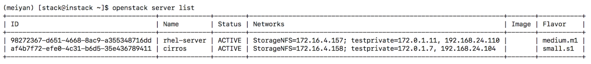
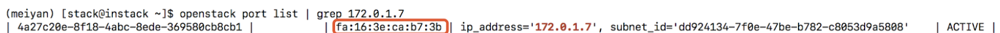
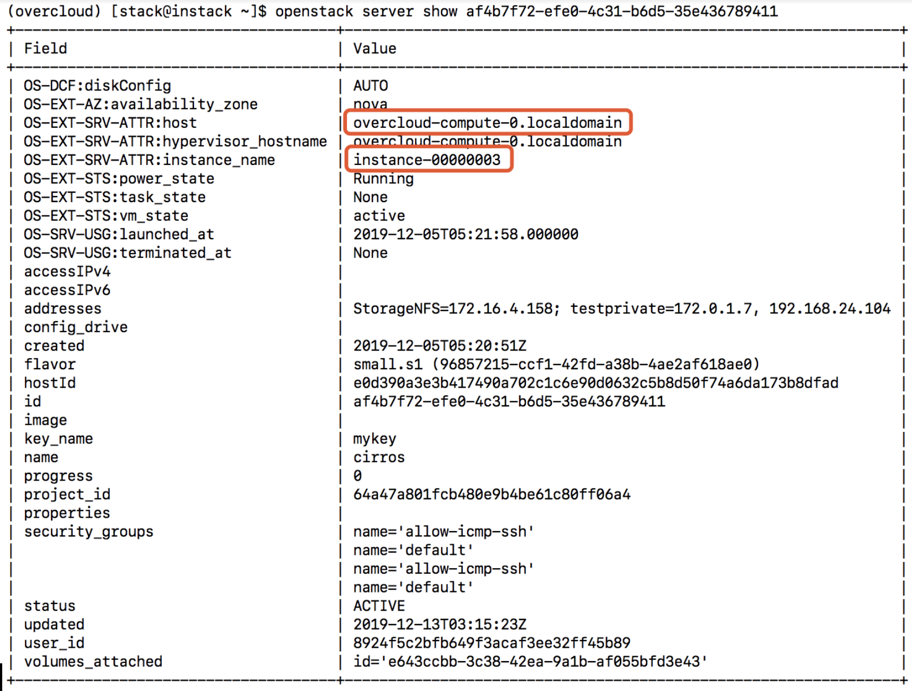
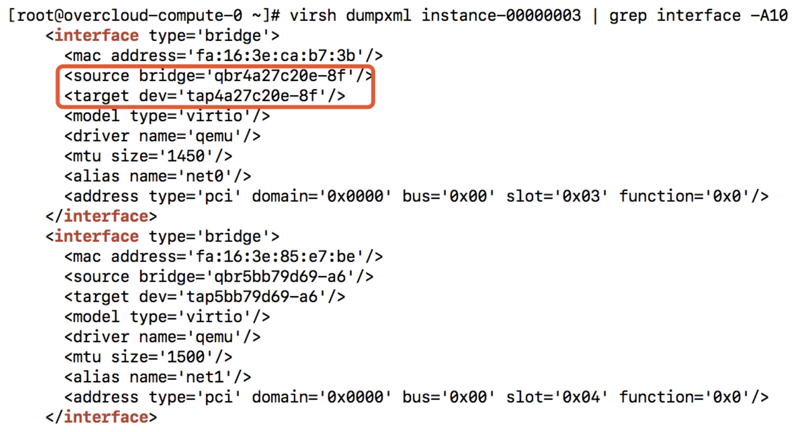
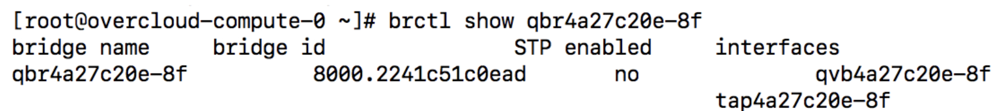
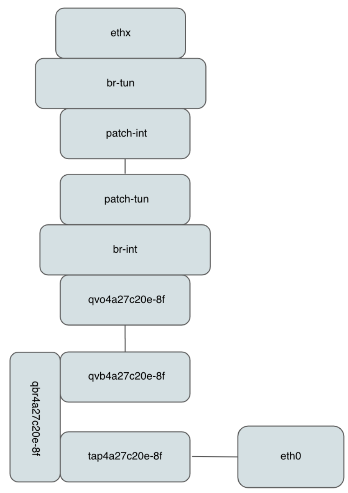
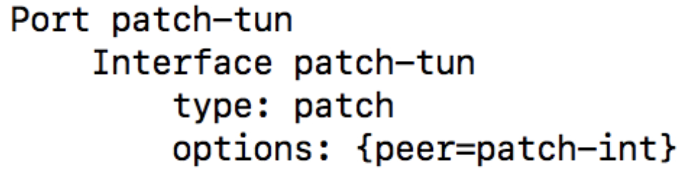
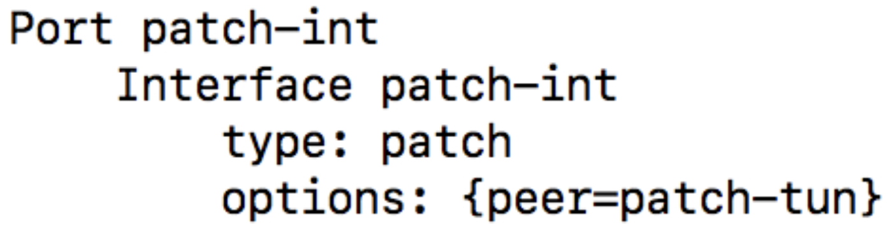
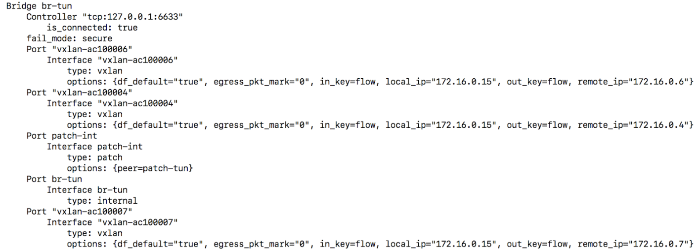
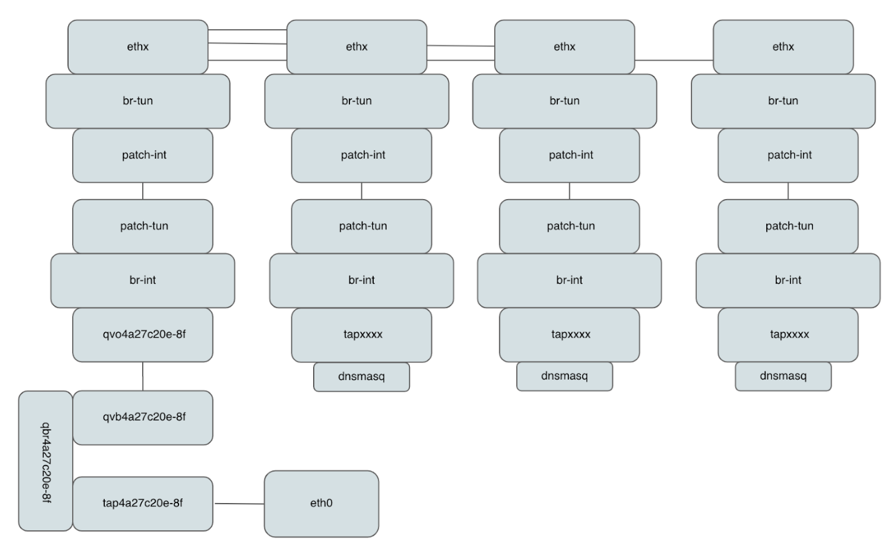

### ml2 ovs
#### 实例到控制节点的网络路径

查看实例mac地址



以管理员身份查看实例，可以了解实例所在Hypervisor和实例名
```
openstack server show af4b7f72-efe0-4c31-b6d5-35e436789411
```


在主机上查看实例，确定对应mac地址的bridge和tap设备



虚拟机通过veth pair把系统里的eth设备和Hypervisor的tap设备连接在一起

tap设备对应linux bridge里的一个端口，网桥上另外一个接口是veth pair的一端，网桥这端的设备是qvbxxxx-yy。
网桥另外一端的设备是qvoxxxx-yy，属于ovs br-int上的端口。

br-int端口patch-tun上联到ovs bridge br-tun上


br-tun侧的接口是patch-int


在br-tun上的包会根据需要把包通过br-tun发送到隧道另一端



数据包顺着隧道传送到控制节点。根据这个示意图可以在进行DHCP分析时在合适的位置抓包分析