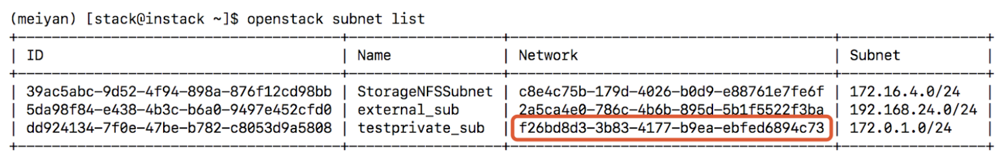
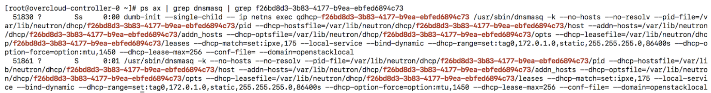
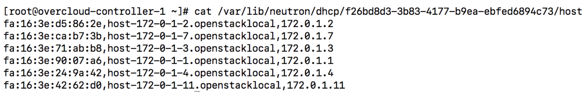
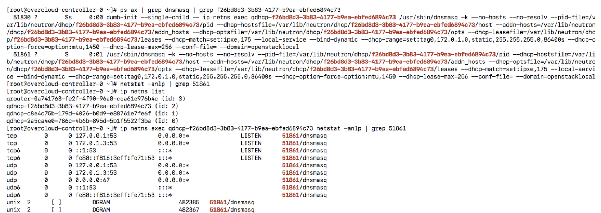
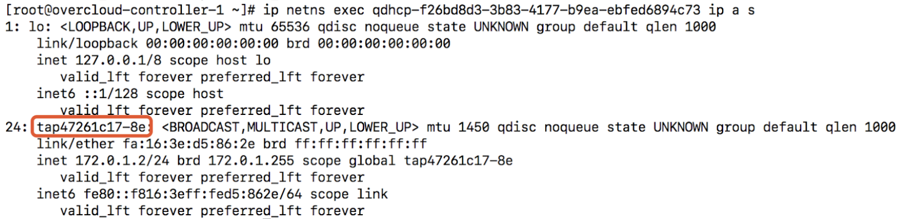
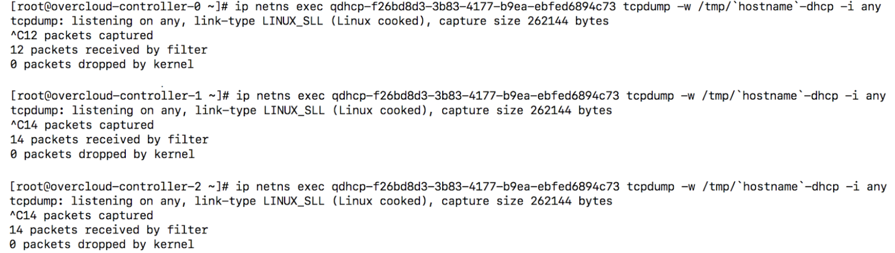
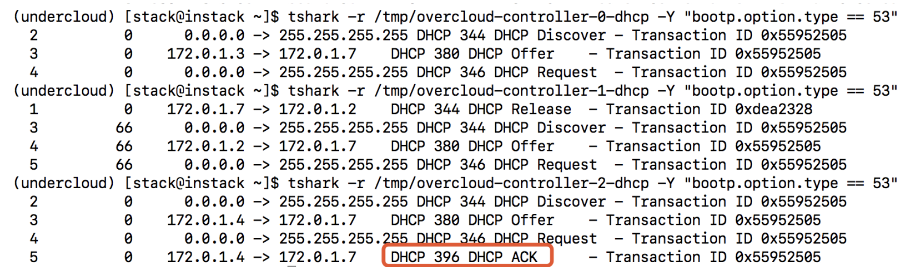

### ml2 ovs
#### 实例DHCP获取ip地址

实例的ip地址通常情况下是通过dhcp获取的，可以通过实例网段确认subnet对应的network id
```
openstack subnet list
```


在每个控制节点上都有dnsmasq进程扮演着dhcp agent的角色
```
ps ax | grep dnsmasq | grep f26bd8d3-3b83-4177-b9ea-ebfed6894c73
```


3个控制节点在network namespace里启动dhcp agent，在控制节点的/var/lib/neutron/dhcp/<netuuid>/host里记录着已分配port的mac地址和对应的ip地址。dnsmasq会根据这个文件的内容为登记的mac地址分配对应的ip地址。
```
cat /var/lib/neutron/dhcp/f26bd8d3-3b83-4177-b9ea-ebfed6894c73/host
```


dhcp agent工作在自己对应的network namespace里，系统默认的network namespace里用netstat应该查不到对应的进程。


当实例启动时，对dhcp agent进行请求，3个控制节点dhcp实例里的某个实例会对请求进行响应。在每个控制节点的qdhcp-xxxx网络namespace里都会有1个tapxxxx-yy接口。


当发生无法分配ip地址时可以对这个接口抓包分析
```
ip netns exec qdhcp-f26bd8d3-3b83-4177-b9ea-ebfed6894c73 tcpdump -w /tmp/`hostname`-dhcp -i any
```


正常情况下某个dhcp agent应该对请求作出应答
```
tshark -r /tmp/overcloud-controller-2-dhcp -Y "bootp" 
```
