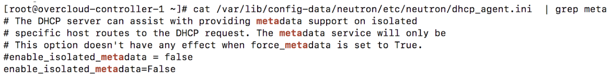

### ml2 ovs
#### 实例如何获取metadata

实例可以通过config drive或者metadata agent获取实例metadata

对于通过metadata agent获取实例metadata支持两种方式： 
1. 通过l3 agent访问metadata agent 
2. 通过dhcp agent访问metadata agent 

这两种方式都要求实例网络可达metadata服务地址

通过metadata agent访问metadata服务地址为 169.254.169.254:80

虚拟机通过qrouter或者qdhcp网络名字空间里的neutron-ns-metadata-proxy将虚拟机对metadata的请求通过unix domain socket转发给neutron-metadata-agent，再转发给nova-api-metadata

qrouter-xxxxx名字空间里的neutron-ns-metadata-proxy

neutron-ns-metadata-proxy的配置文件

/var/lib/neutron/metadata_proxy是用于neutron-ns-metadata-proxy和metadata agent间IPC通信的unix socket

neutron-ns-metadata-proxy监听在9697端口

访问169.254.169.254 80时，通过iptables规则转发请求到neutron-ns-metadata-proxy所监听的端口

neutron-ns-metadata-proxy通过unix domain socket /var/lib/neutron/metadata_proxy发送到neutron-metadata-agent
，neutron-metadata-agent再转发给nova-api-metadata获取相关实例metadata

通过dhcp agent进行neutron-ns-metadata-proxy的方式，与qrouter类似。在控制节点上配置文件/var/lib/config-data/neutron/etc/neutron/dhcp_agent.ini里，配置项enable_isolated_metadata需设置为true

在启动实例时，实例内会增加169.254.169.254的路由

路由指向qdhcp-xxxx namespace里的ip地址，同一个设备上还启用着169.254.169.254

