### ml2 ovs
#### 实例路由

OpenStack neutron的router相当于软件路由器，实现租户间网络路由，租户南北向流量
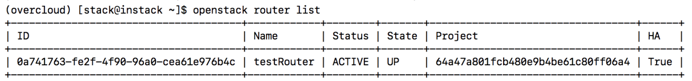

在所有控制节点上都存在router对应的net namespace
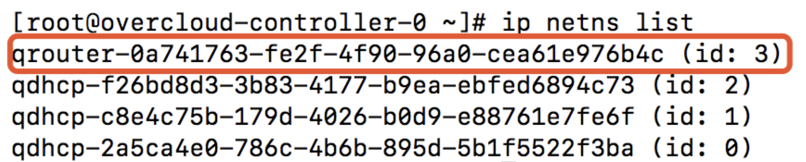

Subnet连接router时subnet所在网段的网关地址在router的network namespace里
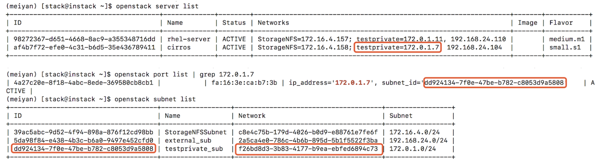

在某个控制节点上，对于某个attach到router的subnet来说，router的namespace里有此网段的网关地址，另外两个控制节点则没有ip地址。router是通过keepalived来对外提供服务的

overcloud-controller-0
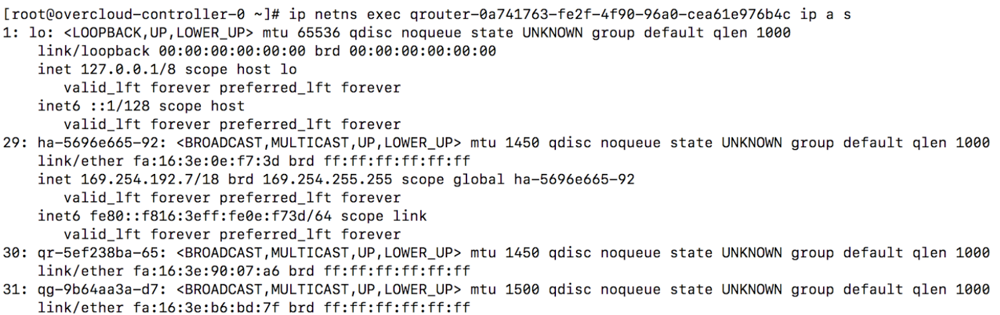

overcloud-controller-1
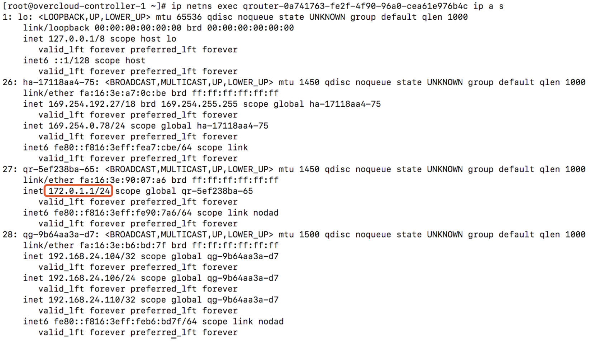

overcloud-controller-2
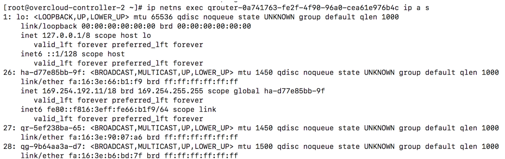

实例的缺省网关在qrouter-xxx网络名字空间里，并且可达
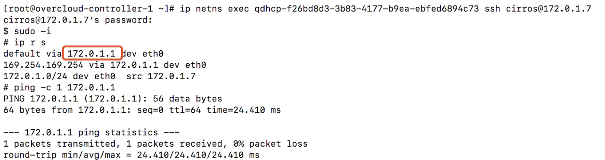

在所有控制节点的qrouter network namespace里包含3个接口 
qr-xxxxx 
qg-yyyyy 
ha-zzzzz 

其中ha-zzzzz接口有169.254.192.x/18网段的ip地址

三个控制节点的ha-zzzzz接口ip地址可互相访问
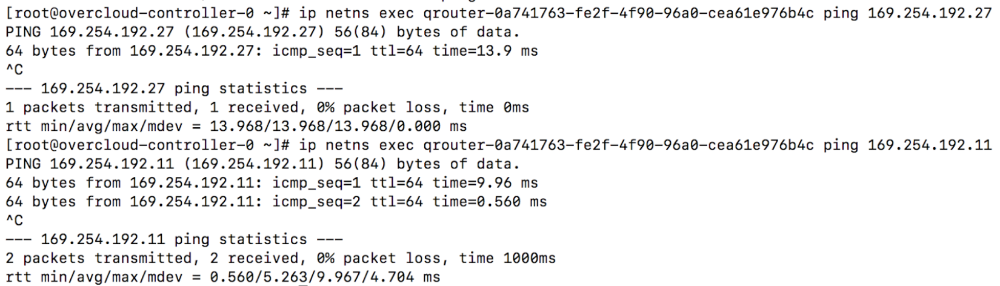

对于每个router，所有控制节点上都通过容器运行着keepalived服务
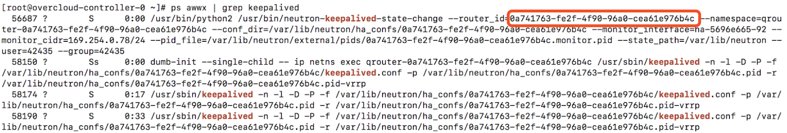

在keepalived的配置里，可以看到virtual_ipaddress是vrrp的ip地址，拥有此地址的节点是master节点，其他节点是backup节点。master节点上会设置virtual_ipaddress_excluded里定义的ip地址，virtual_routes定义的route
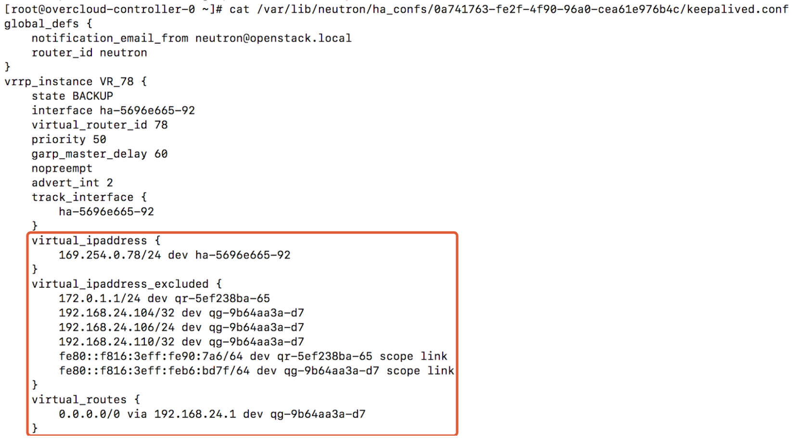
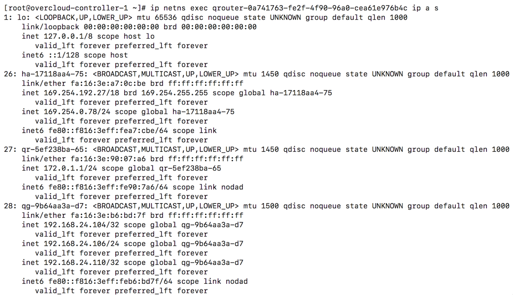
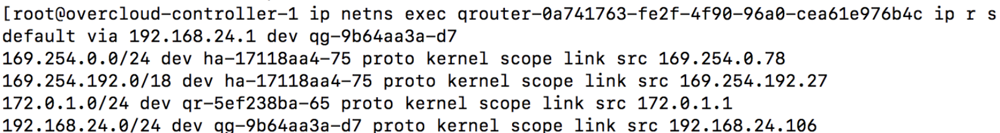

